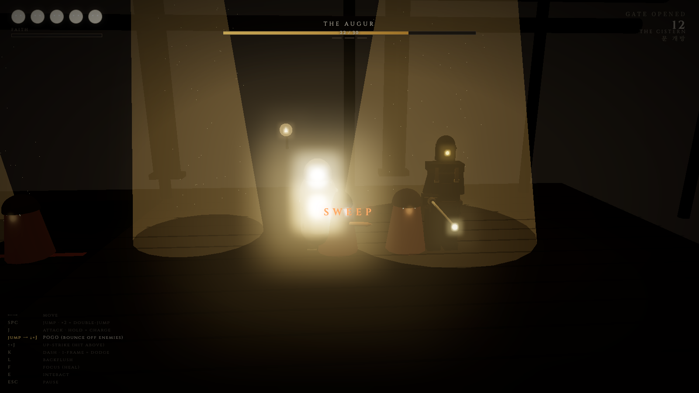

# BACKFLOW



> *…for those who were flushed.*
>
> **변기톤 출품작.**  
> **₩1,500,000짜리 배관 견적에서 태어난 2.5D 메트로배니아.**

---

## 그게 무슨 말이야

2026년 5월. 노마다마스 5층 변기가 막혔다.  
원인: 물티슈, 그리고 그 외의 물에 분해되지 않는 무언가.

> *민성진 — [오후 12:04]*  
> *변기 뜯고, 고압세척 자동차까지 와서 150만원 비용 발생.*

해커하우스의 절대신 [Cheolsable](https://github.com/cheolsable)이 비용을 쾌척하며 한 가지를 주문했다:

> **"다음 주 화요일까지 각자 화장실 관련 product를 빌드해 올 것."**

이것이 그 결과 중 하나다.  
**BACKFLOW** — 흐름을 거스른 자.

---

## 줄거리

**동규형**은 화장실을 제일 많이 쓰는 자였다.

누군가 — **[검열됨]** — 정체불명의 무언가를 변기에 넣었다.  
동규형의 그것은 **역류**했다.

이제 동규형은 다시 변기로 향한다.  
복수를 위해.

> *1문, 개방. 화장실 가는 횟수, 곧 권능.*

…말이 씨가 된다.

---

## 빠른 시작

```bash
git clone git@github.com:NomaDamas/backflow.git
cd backflow
python3 -m http.server 7777
```

→ 브라우저에서 [http://localhost:7777](http://localhost:7777) 열기  
→ 아무 키나 눌러 강하

빌드 도구 없음. npm 없음. 단일 HTML 파일.

---

## 조작

| 키 | 동작 |
|---|---|
| <kbd>←</kbd> <kbd>→</kbd> / <kbd>A</kbd> <kbd>D</kbd> | 이동 |
| <kbd>SPACE</kbd> / <kbd>↑</kbd> | 점프 · 공중에서 한 번 더 = 더블점프 |
| <kbd>J</kbd> (탭) | 공격 |
| <kbd>J</kbd> (홀드) | **차지 공격** — 손 떼면 AoE 강타 |
| <kbd>점프</kbd> → <kbd>↓+J</kbd> | **포고** — 적/지면에서 튕긴다 |
| <kbd>↑+J</kbd> | 위 베기 |
| <kbd>K</kbd> / <kbd>Shift</kbd> | 대시 · i-frame 중 적 공격에 닿으면 **Perfect Dodge** (+FAITH) |
| <kbd>L</kbd> | Backflush 마법 (FAITH 50 소비, 4 데미지 관통) |
| <kbd>F</kbd> (홀드) | Focus 힐 (FAITH 33 소비) |
| <kbd>E</kbd> | 인터랙트 (대화 · 태블릿 · 의자 · charm · 변기) |
| <kbd>ESC</kbd> | 일시정지 + 기록 + 볼륨 |
| <kbd>M</kbd> | 음소거 |

화면 좌측 하단에 항상 표시.

---

## 들어있는 것

### 월드
- 5 구역 코리도 — `the throne` · `lensward` · `wallpath` · `arena approach` · `the cistern`
- 8개 drain light · 5개 wall sconce · 배경 기둥 · 전경 매달린 파이프 · 멀리서 지나가는 그림자
- 천장 파이프 안에 흐르는 물 · 천장에서 떨어지는 물방울 · 공중에 떠다니는 먼지

### 전투
- 3단 콤보 (3타째 = heavy)
- 차지 공격 · 포고 · 위 베기
- Perfect dodge — 대시 i-frame 중 적 공격 통과 → FAITH 보너스 + slow-mo
- Wall jump · 더블 점프 (Monarch Wings)
- Backflush 마법 — 적 다수 관통

### 보스: THE AUGUR
- 3 페이즈 (HP 30) · 5 공격 (Probe · Sweep · Slam · Summon · Jump)
- 페이즈 진행할수록 텔레그래프 짧아짐
- P2 더블 stab · P3 트리플 stab
- 5단 시네마틱 죽음 (꿇어앉음 → 시신은 영구히 남음)

### 적
- **Lens Mendicant** — 작고 빠름, 윈드업 후 lunge
- **Walled Brother** — 두 lens + stripped wire 채찍 (3.5 유닛 reach)

### 영속 진행
- **Lens Fragment** — 단상 위 (점프 도달), +12 FAITH/hit 영구
- **Composite-Shard** — 숨겨진 alcove (더블점프 도달), +1 MAX HP 영구
- gate count 누적 (localStorage) — 죽을수록 권능
- Achievement 시스템

### HUD
- HP · FAITH · Combo counter · Boss bar (HP 숫자 + 페이즈 색조)
- Charm 패널 · Zone indicator · Charge ring · Damage numbers
- 일시정지 통계 + 볼륨 슬라이더
- Tutorial popups · Achievement toasts

### 엔딩
다중 스테이지 시네마틱. 보스 처치 후:
- 과거의 자신들과의 대화
- 자연의 흐름에 대한 깨달음
- 물티슈에 대한 깨달음
- 두 번의 침묵
- "견적 150만원이 나올것 같군."
- 기록 + 크레딧

---

## 기술 스택

| | |
|---|---|
| 3D 엔진 | Three.js r159 (CDN) |
| 게임 로직 | Vanilla JS — 프레임워크 없음 |
| 사운드 | Web Audio API (절차적 SFX + drone + ambient piano) |
| BGM | HTMLAudioElement → MediaElementSource → masterGain |
| UI | CSS — `Cinzel` / `Cormorant Garamond` / `Noto Serif KR` |
| 영속화 | localStorage (gate count · charms · achievements · volume) |
| 의존성 | 0 npm packages · 단일 `index.html` · 5,800+ 줄 |

빌드 없음. 번들러 없음. 그냥 정적 파일 서버 띄우면 됨.

---

## 크레딧

### 실제 사건 (변기톤 발생)

| 역할 | 이름 |
|------|------|
| 원인 분석 · 견적 발표 | 민성진 |
| 절대신 · 50% 후원 | Cheol (`@cheolsable`) |
| 변기톤 사회자 · 공지 작성 | Jeffrey |
| 일찍 발견 | DoYun Ha |
| "만악의 근원" (alleged) | 컴동건 · 최용빈 |
| 의심받는 자 | 릴엠 (allegedly) |
| 토큰 후원 | 연규 — Sisyphus Labs |
| 다뚫어 아저씨 | 합류지점 정리 (A/S 협의 미해결) |

### 빌드
- **개발**: Sisyphus (Oh-My-Opencode)
- **영감**: Hollow Knight (Team Cherry · Ari Gibson)

### 음악
**"The Cell's Secret"** by [Shelley Evans](https://pixabay.com/ko/users/aicanvas-5347436/?utm_source=link-attribution&utm_medium=referral&utm_campaign=music&utm_content=436665) — [Pixabay](https://pixabay.com/music//?utm_source=link-attribution&utm_medium=referral&utm_campaign=music&utm_content=436665) (Pixabay License)

### 폰트
- Cinzel · Cormorant Garamond · Noto Serif KR (Google Fonts)

---

## 규칙 (현실 세계)

> ☒ **변기에 물티슈 금지**  
> ☒ **키친타월 금지**  
> ☒ **음식물 · 휴지 외 금물**
>
> 재발 시 견적: **₩1,500,000**

다음에 또 막히면 그땐 다른 누군가가 절대신 자리에 오를 것이다.

---

## License

MIT. 변기는 자유롭게.

---

> *복수를 해도, 자연의 흐름은 돌아오지 않아.*  
> *변기에는 절대로, 물티슈를 넣어서는 안 된다.*  
> *...*  
> *...*  
> *견적 150만원이 나올것 같군.*
